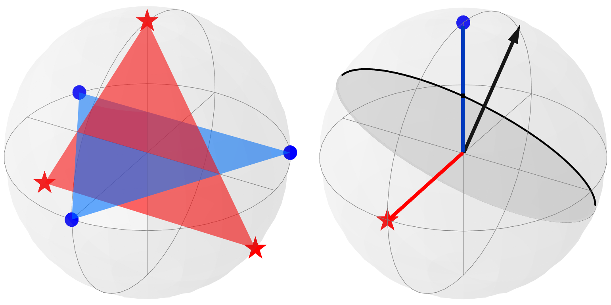
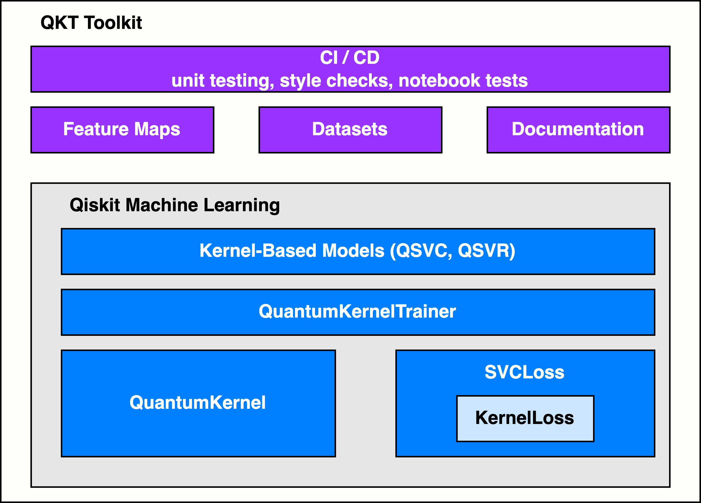

<!-- SHIELDS -->

<!-- PROJECT LOGO -->
 

  
  <h2 align="center">Quantum Kernel Training Toolkit</h2>

  

   
   
  

<!-- TABLE OF CONTENTS -->
### Table of Contents
* [Installation](INSTALL.md)
* [Tutorials](docs/tutorials/)
* [How-Tos](docs/how_tos/)
* [Background](docs/background/)
* [How to Give Feedback](#how-to-give-feedback)
* [Contribution Guidelines](#contribution-guidelines)
* [Acknowledgements](#acknowledgements)
* [About Prototypes](#about-prototypes)
* [References](#references)
* [License](#license)

----------------------------------------------------------------------------------------------------

<!-- ABOUT THIS PROJECT -->
### About This Project

The quantum kernel training (QKT) toolkit is designed to enable users to leverage quantum kernels for machine learning tasks; in particular, researchers who are interested in investigating quantum kernel training algorithms in their own research, as well as practitioners looking to explore and apply these algorithms to their machine learning applications. 

We've designed this python-based toolkit around new components in Qiskit Machine Learning that provide extensible kernel training capabilities, documentation to guide users, as well as datasets and utilities for exploring and testing concepts.

This project evolved out of research at IBM Quantum on ["Covariant Quantum Kernels for Data with Group Structure"](https://arxiv.org/abs/2105.03406) [[1]](#references).

***Problem Statement***

Given a labeled dataset, optimize a parametrized quantum kernel, according to a given loss function, for a machine learning task. For example, use quantum kernel alignment (QKA) as a loss function to iteratively adapt a quantum kernel to a classification dataset while converging to the maximum SVM margin.

***Why Does It Matter?***

Kernel methods are widespread in machine learning applications. A kernel is a similarity measure between data encoded in a high-dimensional feature space and can be utilized, for instance, in classification tasks with support vector machines. It is known that quantum computers can be used to replace classical feature spaces by encoding data in a quantum-enhanced feature space. Using an algorithm called the quantum kernel estimator (QKE), one can compute quantum kernels with data provided classically [[2]](#references). A key observation of this work was that a necessary condition for a computational advantage requires quantum circuits for the kernel that are hard to estimate classically. More recently, researchers proved that a quantum kernel can offer superpolynomial speedups over any classical learner on a particular learning problem based on the hardness of the discrete logarithm problem [[3]](#references). Furthermore, this particular kernel is contained in a kernel family, called covariant quantum kernels, that can be used for data with a group structure [[1]](#references). These results indicate that quantum kernels are an increasingly promising approach in machine learning problems. 

However, finding a good quantum kernel for any given dataset can be a challenging problem in practice. Sometimes, structure in the data can inform this selection, other times a kernel is chosen in an ad hoc manner. Quantum Kernel Alignment (QKA) is one approach to learning a quantum kernel on a dataset. This technique iteratively adapts a parametrized quantum kernel to have high similarity to a target kernel informed from the underlying data distribution, while converging to the maximum SVM margin [[1,4-6]](#references). Such an approach has connections to the performance of the machine learning model; that is, QKA finds a quantum kernel, from a family of kernels, that yields the smallest upper bound to the generalization error. For data with an underlying group structure, covariant quantum kernels can be designed to exploit that structure. In this case, QKA provides a way to optimize the fiducial state of the quantum feature map on such a dataset. This toolkit provides examples of datasets with group structure and corresponding covariant quantum kernels. More information can be found in the [background material](docs/background/qkernels_and_data_w_group_structure.ipynb) and in Ref. [[1]](#references).

To enable future research on quantum kernel training algorithms, this toolkit is extensible to methods beyond QKA. More information about the design is provided in the next section.

***Overall Architecture***

The structure of the QKT Toolkit is illustrated in the diagram below. New components and features were integrated into Qiskit Machine Learning to enable training of quantum kernels. The QKT Tookit is built on top of these integrations and includes local components such as datasets, feature maps, and documentation&mdash;all maintained with style, unit, and notebook tests.

 

  

***New Integrations into Qiskit Machine Learning***

* `QuantumKernelTrainer`: (New) Class to manage quantum kernel training for a given loss function and optimizer.
* `QuantumKernel`: Option to handle quantum kernels with trainable parameters.
* `KernelLoss`: (New) Base class to calculate loss of quantum kernel functions over trainable parameters and input data.
* `SVCLoss(KernelLoss)`: (New) Class to compute loss corresponding to QKA for classification tasks.

This framework is extensible to other loss functions and optimizers and is compatible with Qiskit's existing kernel-based model interfaces (e.g., classification with `QSVC` and regression with `QSVR`).

***Datasets and Feature Maps***

The QKT toolkit includes datasets useful for illustrating how to train quantum kernels. Two [datasets with a particular underlying group structure](data) are provided for 7 and 10 qubits. These datasets can be used with a [covariant quantum kernel](qkt/feature_maps/covariant_feature_map.py) to test and explore kernel training algorithms. More information about the datasets and kernel can be found in the [background material](docs/background/qkernels_and_data_w_group_structure.ipynb).

***Documentation***

The QKT Toolkit includes documentation split into
- [Tutorials](docs/tutorials): longer examples of end-to-end usage
- [How-to guides](docs/how_tos): targeted answers to common questions
- [Background material](docs/background): in-depth information about quantum kernels and algorithms

----------------------------------------------------------------------------------------------------

<!-- HOW TO GIVE FEEDBACK -->
### How to Give Feedback

We encourage your feedback! You can share your thoughts with us by:
- [Opening an issue](https://github.com/IBM-Quantum-prototypes/quantum-kernel-training/issues) in the repository
- [Starting a conversation on GitHub Discussions](https://github.com/IBM-Quantum-prototypes/quantum-kernel-training/discussions)
- Filling out our [survey](https://airtable.com/shrFxJXYzjxf5tFvx)

----------------------------------------------------------------------------------------------------

<!-- CONTRIBUTION GUIDELINES -->
### Contribution Guidelines

For information on how to contribute to this project, please take a look at our [contribution guidelines](CONTRIBUTING.md).

----------------------------------------------------------------------------------------------------

<!-- ACKNOWLEDGEMENTS -->
### Acknowledgements

This toolkit is based on the research described in [[1]](#references).

The initial codebase was written by Jennifer R. Glick and Tanvi P. Gujarati.

----------------------------------------------------------------------------------------------------

<!-- ABOUT PROTOTYPES -->
### About Prototypes

Prototypes is a collaboration between developers and researchers that will give users access to prototypes from cutting-edge research in areas like quantum simulation and machine learning. These software packages are built on top of, and may eventually be integrated into the Qiskit SDK. They are a contribution as part of the Qiskit community.

Check out our [blog post](https://medium.com/qiskit/try-out-the-latest-advances-in-quantum-computing-with-ibm-quantum-prototypes-11f51124cb61) for more information!

----------------------------------------------------------------------------------------------------

<!-- REFERENCES -->
### References
[1] Jennifer R. Glick, Tanvi P. Gujarati, Antonio D. Córcoles, Youngseok Kim, Abhinav Kandala, Jay M. Gambetta, and Kristan Temme. Covariant quantum kernels for data with group structure. [link](https://arxiv.org/abs/2105.03406) 

[2] Havlíček et al. Supervised learning with quantum-enhanced feature spaces. _Nature_ **567**, 209 (2019) [link](https://www.nature.com/articles/s41586-019-0980-2) 

[3] Liu et al. A rigorous and robust quantum speed-up in supervised machine learning. _Nature Physics_ **17**, 1013 (2021) [link](https://www.nature.com/articles/s41567-021-01287-z) 

[4] B. E. Boser et al. Proceedings of the Fifth Annual Workshop on Computational Learning Theory. COLT ’92, 144-152 [link](https://doi.org/10.1145/130385.130401) 

[5] V. Vapnik. The Nature of Statistical Learning Theory. Information Science and Statistics (Springer New York, 2013) [link](https://books.google.com/books?id=EqgACAAAQBAJ) 

[6] N. Cristianini et al. Advances in Neural Information Processing Systems 14 (2001) [link](https://proceedings.neurips.cc/paper/2001/file/1f71e393b3809197ed66df836fe833e5-Paper.pdf) 

Qiskit Global Summer School on Quantum Machine Learning (in particular, lectures [6.1](https://learn.qiskit.org/summer-school/2021/lec6-1-from-variational-classifiers-linear-classifiers), [6.2](https://learn.qiskit.org/summer-school/2021/lec6-2-quantum-feature-spaces-kernels), and [6.3](https://learn.qiskit.org/summer-school/2021/lec7-1-quantum-kernels-practice))

----------------------------------------------------------------------------------------------------

<!-- LICENSE -->
### License
[Apache License 2.0](LICENSE.txt)
